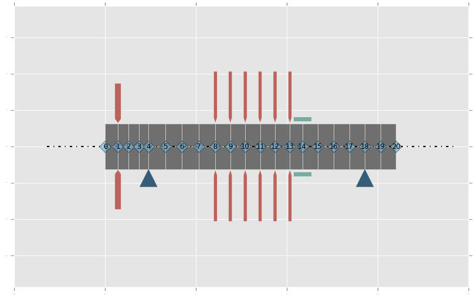
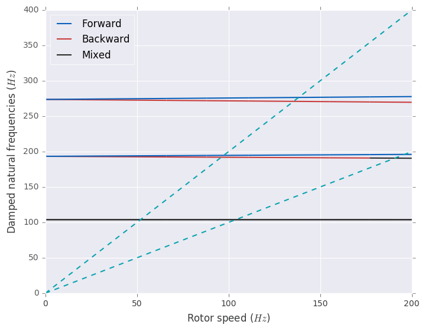

Compressor
==========

.. code:: ipython3

    from LaviRot import *
    %matplotlib inline

x + \alpha

.. code:: ipython3

    si_d = 0
    so_d = 0.127
    E = 211e9
    Gs = 81.2e9
    rho = 7810

.. code:: ipython3

    L = [0.07, # thrust collar
        0.058,
        0.058, # 0 probe
        0.052, # 0 bearing
        0.092,
        0.092,
        0.092,
        0.092, # 0 impeller
        0.082, # 1 impeller
        0.082, # 2 impeller
        0.082, # 3 impeller
        0.082, # 4 impeller
        0.082, # 5 impeller
        0.068, # honeycomb # change diameter
        0.086,
        0.086,
        0.086,
        0.086, # 1 bearing
        0.086,
        0.086]
    print(L)

.. parsed-literal::

    [0.07, 0.058, 0.058, 0.052, 0.092, 0.092, 0.092, 0.092, 0.082, 0.082, 0.082, 0.082, 0.082, 0.068, 0.086, 0.086, 0.086, 0.086, 0.086, 0.086]
    

.. code:: ipython3

    nelem = [x for x in range(len(L))]
    nelem

.. parsed-literal::

    [0, 1, 2, 3, 4, 5, 6, 7, 8, 9, 10, 11, 12, 13, 14, 15, 16, 17, 18, 19]

.. code:: ipython3

    shaft_elem = [ShaftElement(n, l, si_d, so_d, E, Gs, rho,
                       shear_effects=True,
                       rotary_inertia=True,
                       gyroscopic=True) for n, l in zip(nelem, L)]

.. code:: ipython3

    colar = DiskElement(1, rho, 0.035, so_d, 0.245)
    disk0 = DiskElement(8, rho, 0.02, so_d, 0.318)
    disk1 = DiskElement(9, rho, 0.02, so_d, 0.318)
    disk2 = DiskElement(10, rho, 0.02, so_d, 0.318)
    disk3 = DiskElement(11, rho, 0.02, so_d, 0.318)
    disk4 = DiskElement(12, rho, 0.02, so_d, 0.318)
    disk5 = DiskElement(13, rho, 0.02, so_d, 0.318)

.. code:: ipython3

    stfx = 1e8
    stfy = 1e8
    bearing0 = BearingElement(4, stfx, stfy, 0, 0)
    bearing1 = BearingElement(-3, stfx, stfy, 0, 0)
    seal = SealElement(14, 0*stfx, 0*stfy, 0, 0)

.. code:: ipython3

    rotor1 = Rotor(shaft_elem,
                   [colar, disk0, disk1, disk2, disk3, disk4, disk5],
                   [bearing0, bearing1, seal])

.. code:: ipython3

    plot_rotor(rotor1)

.. code:: ipython3

    speed = np.linspace(0, 200, 10)

.. code:: ipython3

    campbell(rotor1, speed, mult=[1, 2])

